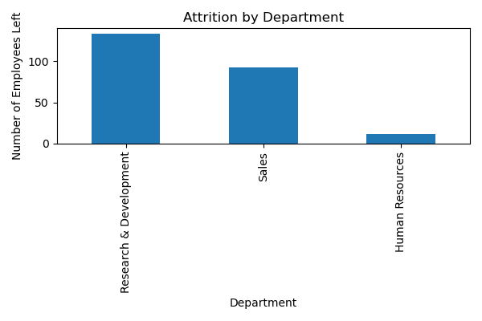
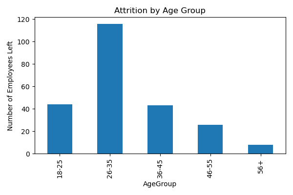
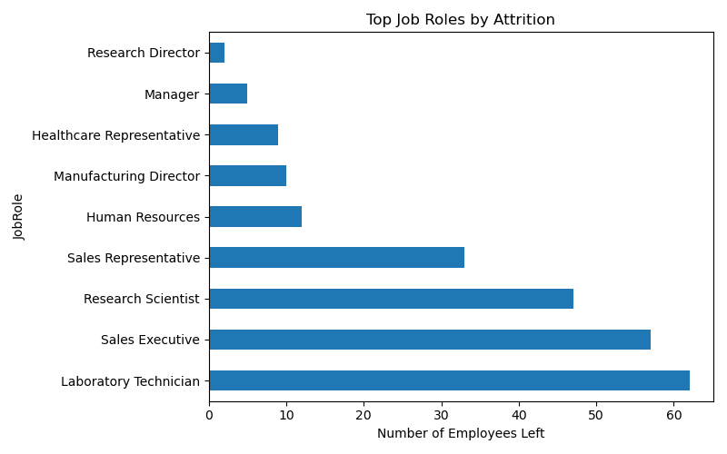

# 🧑‍💼 HR Attrition Analysis — End-to-End Data Analytics Project

  
  
  

---

## 📌 Project Summary

This project analyzes **employee attrition patterns** using HR data to answer a critical business question:

> **Why do employees leave, and which segments are at highest risk of turnover?**

The objective is to support **HR leadership and business managers** with data-driven insights that can help design **targeted retention strategies**, reduce hiring costs, and improve workforce stability.

This is a complete analytics case study covering:

- Data cleaning & feature engineering (Python)
- Exploratory analysis & visualization
- Executive-ready **Power BI dashboard**
- Business insights & recommendations

---

## 🎯 Business Objectives

The key objectives of this analysis were:

- Quantify overall attrition and identify high-risk segments
- Analyze attrition across **Department, Job Role, Age, Salary, and Workload**
- Identify the **primary drivers of employee turnover**
- Translate analytical findings into **actionable business recommendations**

---

## 📂 Dataset Overview

- **Source:** IBM HR Analytics – Employee Attrition & Performance (Kaggle)
- **Total Records:** 1,470 employees
- **Key Features:**
  - Demographics: Age, Gender, MaritalStatus
  - Job: Department, JobRole, YearsAtCompany, OverTime
  - Compensation: MonthlyIncome
  - Satisfaction: JobSatisfaction, WorkLifeBalance

---

## 🧹 Data Preparation & Feature Engineering

To ensure analysis-ready data, the following steps were performed:

### Cleaning

- Removed non-informative columns:
  - `EmployeeCount`, `StandardHours`, `Over18`, `EmployeeNumber`
- Verified:
  - No missing values
  - No duplicate records

### Feature Engineering

Created business-friendly analytical features:

- **AgeGroup**
  - 18–25, 26–35, 36–45, 46–55, 56+

- **SalarySlab**
  - Low, Medium, High, Very High

- Converted coded ordinal variables into meaningful labels:
  - WorkLifeBalance
  - JobSatisfaction
  - EnvironmentSatisfaction
  - RelationshipSatisfaction

This improved **interpretability** and enabled segment-level analysis.

---

## 🛠 Tools & Technologies

- **Python**
  - pandas — data cleaning & transformation
  - matplotlib — exploratory visualizations
- **Jupyter Notebook** — analysis workflow
- **Power BI** — interactive executive dashboard
- **GitHub** — version control & portfolio hosting

---

## 📊 Key Metrics

The core business KPIs tracked in this project:

- **Total Employees:** 1,470
- **Employees Left:** 237
- **Overall Attrition Rate:** ~16.1%

These KPIs form the foundation of both the Python analysis and the Power BI dashboard.

---

## 🔍 Analytical Findings & Key Insights

### 1️⃣ Department-wise Attrition

- **Research & Development** contributes the highest number of exits
- Followed by **Sales**, with minimal attrition in **HR**

**Business Insight:**
R&D is both the largest workforce and the largest attrition contributor — retention efforts must be department-specific.

---

### 2️⃣ OverTime vs Attrition

- Employees working **OverTime = Yes** show **~3x higher attrition**

**Business Insight:**
Workload and burnout are among the **strongest drivers** of employee exits.

---

### 3️⃣ Age Group Analysis

- The **26–35 age group** has the highest attrition

**Business Insight:**
Early-career professionals are more likely to switch jobs for growth, salary, and career acceleration.

---

### 4️⃣ Salary Slab Analysis

- Highest attrition observed in the **Low salary slab**

**Business Insight:**
Compensation is a **primary retention lever**; underpaid employees are significantly more likely to leave.

---

### 5️⃣ Job Role Analysis

- **Laboratory Technicians** show the highest attrition among all roles

**Business Insight:**
Role-specific issues such as repetitive work, limited growth, or pay structure may be driving exits.

---

## 📊 Interactive Power BI Dashboard

An executive-ready **Power BI dashboard** was built to allow stakeholders to explore attrition dynamically.

### Dashboard Components

**KPI Cards**

- Total Employees
- Total Attrition
- Attrition Rate (%)

**Core Visuals**

- Attrition by Department
- Attrition by Job Role
- Attrition by Age Group
- Attrition by Salary Slab
- Attrition by OverTime

**Slicers (Filters)**

- Department
- Job Role
- Age Group
- Salary Slab

The dashboard enables:

- Quick executive overview
- Drill-down analysis by segment
- Identification of high-risk employee groups

---

## 💡 Business Recommendations

Based on the analysis, the following actions are recommended:

### ✅ 1. Reduce Overtime & Workload

- Introduce workload balancing and shift rotation
- Hire additional staff in high-pressure teams

### ✅ 2. Revise Compensation for Low Salary Segments

- Prioritize salary corrections in the **Low salary slab**
- Introduce performance-linked incentives

### ✅ 3. Target Retention for 26–35 Age Group

- Structured career growth plans
- Mentorship and internal mobility programs

### ✅ 4. Improve Conditions for High-Risk Roles

- Redesign job roles for Laboratory Technicians
- Introduce recognition and skill development programs

### ✅ 5. Department-Specific Retention Strategy

- Tailored retention programs for R&D and Sales
- Flexible work policies and growth incentives

---

## 📌 Project Deliverables

- 📓 Jupyter Notebook — Full Python analysis
- 📊 Power BI Dashboard — Interactive executive view
- 🖼️ `images/` folder — All analysis charts
- 📄 This README — Executive documentation

---

## 👩‍💻 Author

**Rachita Kadam**  
Data Analytics Portfolio Project

---

> _This project demonstrates the complete analytics lifecycle — from data preparation to executive-level insights and business recommendations._
